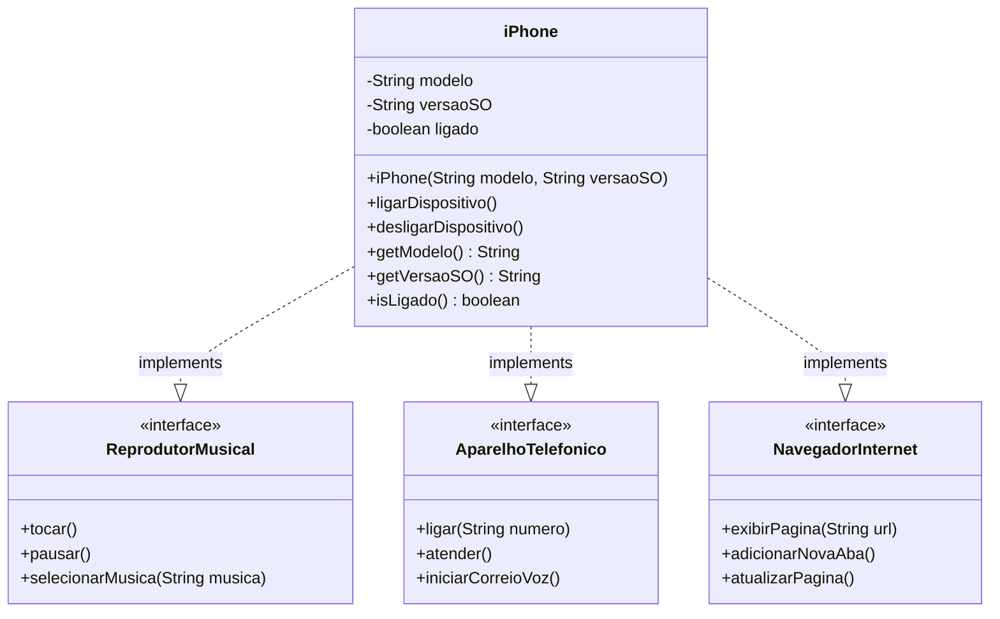

# 📱 Desafio POO - Modelagem e Diagramação do iPhone

## 📋 Descrição

Este projeto implementa a modelagem orientada a objetos do iPhone original de 2007, baseado no histórico lançamento apresentado por Steve Jobs. O desafio consiste em representar as três principais funcionalidades do dispositivo através de interfaces e classes Java, seguindo os princípios da Programação Orientada a Objetos.

## 🎯 Objetivo

Modelar e implementar as funcionalidades do iPhone como:
- **📱 Aparelho Telefônico**
- **🎵 Reprodutor Musical**
- **🌐 Navegador na Internet**

## 🏗️ Diagrama UML



## 🚀 Funcionalidades Implementadas

### 📞 Aparelho Telefônico
- `ligar(String numero)` - Realiza chamadas telefônicas
- `atender()` - Atende chamadas recebidas
- `iniciarCorreioVoz()` - Acessa o correio de voz

### 🎵 Reprodutor Musical
- `tocar()` - Reproduz a música selecionada
- `pausar()` - Pausa a reprodução atual
- `selecionarMusica(String musica)` - Seleciona uma música para reprodução

### 🌐 Navegador na Internet
- `exibirPagina(String url)` - Carrega e exibe páginas web
- `adicionarNovaAba()` - Abre novas abas do navegador
- `atualizarPagina()` - Atualiza a página atual

## 📁 Estrutura do Projeto

```
src/
├── interfaces/
│   ├── ReprodutorMusical.java
│   ├── AparelhoTelefonico.java
│   └── NavegadorInternet.java
├── model/
│   └── iPhone.java
└── test/
    └── TesteiPhone.java
```

## 💻 Como Executar

### Pré-requisitos
- Java JDK 8 ou superior
- IDE de sua preferência (IntelliJ IDEA, Eclipse, VS Code)

### Passos para execução

1. **Clone o repositório**
   ```bash
   git clone https://github.com/seu-usuario/desafio-iphone-poo.git
   cd desafio-iphone-poo
   ```

2. **Compile os arquivos Java**
   ```bash
   javac *.java
   ```

3. **Execute a classe de teste**
   ```bash
   java TesteiPhone
   ```

## 🧪 Exemplo de Uso

```java
// Criando uma instância do iPhone
iPhone meuiPhone = new iPhone("iPhone 2G", "iOS 1.0");

// Ligando o dispositivo
meuiPhone.ligarDispositivo();

// Usando como reprodutor musical
meuiPhone.selecionarMusica("Imagine - John Lennon");
meuiPhone.tocar();
meuiPhone.pausar();

// Usando como telefone
meuiPhone.ligar("(11) 99999-9999");
meuiPhone.atender();

// Usando como navegador
meuiPhone.exibirPagina("https://www.apple.com");
meuiPhone.adicionarNovaAba();
```

## 🎨 Conceitos de POO Aplicados

### ✅ **Abstração**
- Interfaces definem contratos claros para cada funcionalidade
- Detalhes de implementação encapsulados na classe iPhone

### ✅ **Encapsulamento**
- Atributos privados com acesso controlado via métodos públicos
- Estado interno protegido contra modificações indevidas

### ✅ **Herança/Implementação**
- iPhone implementa múltiplas interfaces
- Reutilização de código através de contratos bem definidos

### ✅ **Polimorfismo**
- Mesma instância pode ser tratada como diferentes tipos
- Flexibilidade na utilização das funcionalidades

## 📚 Princípios SOLID Aplicados

- **🔹 SRP**: Cada interface tem uma responsabilidade específica
- **🔹 OCP**: Extensível para novas funcionalidades sem modificar código existente
- **🔹 ISP**: Interfaces segregadas por funcionalidade
- **🔹 DIP**: Dependência de abstrações (interfaces) ao invés de implementações concretas

## 🛠️ Tecnologias Utilizadas

- **Java** - Linguagem de programação
- **POO** - Paradigma de programação
- **UML** - Modelagem visual
- **Mermaid** - Geração de diagramas

## 📖 Referências

- [Lançamento do iPhone 2007 - Steve Jobs](https://www.youtube.com/watch?v=MnrJzXM7a6o) (00:15 - 00:55)
- [Trilha Java Básico - DIO](https://github.com/digitalinnovationone/trilha-java-basico)

## 👨‍💻 Autor

Desenvolvido como parte do desafio da trilha Java Básico da Digital Innovation One (DIO).

## 📄 Licença

Este projeto está sob a licença MIT. Veja o arquivo [LICENSE](LICENSE) para mais detalhes.

---

⭐ **Se este projeto foi útil para você, considere dar uma estrela no repositório!**
